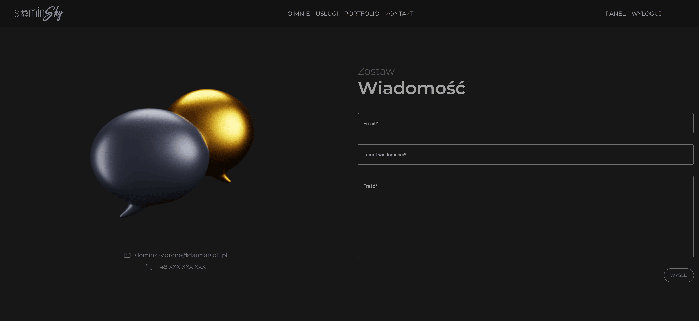

# Drone Enterprise Management App

[Polish version](./README.md)

An application developed for my own enterprise related to services using Unmanned Aerial Vehicles. This project is simultaneously my bachelor's thesis entitled ‘Single Page Application supporting a company providing services with the use of unmanned aerial vehicles’.

The application includes a layer for the presentation of services and key aspects of providing services, the overview of selected services in the form of a portfolio modelled on a popular social media platform and an authorisation layer where a logged-in user has access to a user panel including a form for placing an order for a service. The administrator has restricted access to modify the content of the portfolio as well as to manage the status of the order state.

## Key featurees

-   Responsivity (RWD)
-   User session-based authentication with cookie files
-   Robust and elaborated UI/UX
-   Testing coverage
-   Usage of efficient solutions provided by the various frameworks
-   E-mail notifications

## Technology stack

-   Frontend: Angular (Typescript)
-   Backend: Laravel (PHP)
-   DB: PostgreSQL
-   Style: Tailwind, CSS3
-   Components: Angular Materials, PrimeNG
-   Tests: PHPUint (Backend), Cypress (Frontend)

The frontend was created using the Angular framework resulting in a single-page application (SPA). A REST API with an authorisation layer (Sanctum library) was created using the Laravel framework. A powerful relational database engine, PostgreSQL, was used.

Styles were mainly defined using the Tailwind library with slight modifications on the CSS3 side. The project also uses ready to use components such as Carousel, Timeline, Stepper or Toast offered by Angular Materials and PrimeNG.

## Used Extensions

-   [AOS - Animate On Scroll](https://www.npmjs.com/package/aos) - library used to implement scroll-sensitive animations
-   [Cookie Service](https://www.npmjs.com/package/ngx-cookie-service) - cookie support library
-   [Angular Materials](https://v16.material.angular.io/) - Materials type library closely related and dedicated to the Angular framework
-   [PrimeNG](https://primeng.org) - component library dedicated to the Angular framework
-   [Angular Code Input](https://www.npmjs.com/package/angular-code-input) - a library to support the handling of verification codes
-   [@tailwindcss/aspect-ratio](https://www.npmjs.com/package/@tailwindcss/aspect-ratio) - a library to support the responsiveness of elements defined by fixed proportion
-   [Google Maps API](https://www.npmjs.com/package/@angular/google-maps) - a library to support the use of the functionalities offered by the Google Maps API platform

## Features overview

### Home Page


The Home Page consists of the above banner, a presentation of the strengths of the providied services, a shortcut to the services offer, a shortcut to the portfolio and a shortcut to the contact form - fully responsive across variety of devices with crucial moblie-first rule. Similarly, the navigation bar - for a suitable menu width, it goes into ‘hamburger’ mode. The content of the navigation bar is closely related to the user's authorisation state.

### Service Overview

The app has a dedicated tab containing a shortcut to all available services. You navigate to the service details by selecting the relevant service tab.


Po wybraniu usługi przechodzimy do szczegółow z nią związanych. Z tego poziomu można przejść do informacji związanych z procedurą realizacji zamówienia, formularza składania zamówienia, formularza kontaktowego lub portfolio.


### Autoryzacja

The authentication implemented within the REST API works using the Sanctum library. As already mentioned, user authentication involves the generation of a unique session based on browser cookies.

Furthermore, the project's REST API implementation uses CSRF security mechanisms. The permissions for application-related activities by role are presented below.

| Role  | Privileges                                     |
| ----- | ---------------------------------------------- |
| Guest | Registration, Portfolio showcase, Contact form |
| User  | Sign in form, User panel, Order create form    |
| Admin | Portfolio and orders management                |

Endpoints containing restrictions on the user role use the CheckRole API middleware.

_Middleware/CheckRole.php:_

```
public function handle(Request $request, Closure $next, ...$roles): Response
    {
        $user = $request->user();

        if (!$user || !in_array($user->role, $roles)) {

            return $this->error(
                'You have no privileges to call that endpoint',
                'UNAUTHORIZED',
                401
            );
        }
        return $next($request);
    }
```

```
    Route::post('/posts/create', [PostController::class, 'store'])->middleware('restrictRole:admin');
```

All requests with the exception of request type _GET_ must be authorised for CSRF security.

To ensure that the request is not rejected, the endpoint intended for CSRF authorisation must be queried before the actual request is made.

```http
  GET /sanctum/csrf-cookie
```

In return, the API assigns the corresponding CSRF key, which should be included in the actual request in the form of a **Set-Cookie** header.

On the client side, Angular ensures that any request that is not of type _GET_ is preceded by a CSRF endpoint query with usege of **http interceptors**:

_csrf.interceptor.ts_

```javascript
intercept(
    req: HttpRequest<any>,
    next: HttpHandler
  ): Observable<HttpEvent<any>> {
    if (req.method !== 'GET') {
      return from(this.csrfService.fetchCsrfToken()).pipe(
        switchMap(() => {
          const csrfToken = this.csrfService.getCsrfToken();
          const clonedRequest = req.clone({
            headers: req.headers.set(
              'X-XSRF-TOKEN',
              csrfToken ? csrfToken : ''
            ),
          });
          return next.handle(clonedRequest);
        })
      );
    } else {
      return next.handle(req);
    }
  }
```

_csrf.service.ts_

```javascript
private csrfToken: string = this.cookieService.get('XSRF-TOKEN');

  async fetchCsrfToken(): Promise<void> {
    try {
      console.log('inside fetch csrf method');
      await this.http.get('http://localhost:8000/sanctum/csrf-cookie', {
        headers: new HttpHeaders({
          'Accept': 'application/json',
          'Content-Type': 'application/json',
        }),
        withCredentials: true,
      }).toPromise();
      this.csrfToken = this.cookieService.get('XSRF-TOKEN');
    } catch (error) {
      console.error('Failed to fetch CSRF token', error);
    }
  }

  getCsrfToken(): string | null {
    return this.csrfToken;
  }
```

#### Rejestracja

The app allows guests to create a user account by entering their email address, password, accepting the terms and conditions and optionally accepting assignment to the newsletter.

```http
  POST /register
```


The application dynamically checks the validation of the form fields and also informs the user of the occurrence of an error in the form of a notification in the form or in the form of dynamic _Toasts_ components.

The next step after successful submission of the form is account verification. For this purpose, a 6-digit code is sent to the provided e-mail address, which must be entered in the appropriate place on the verification page. The code is valid for 24 hours and after this time it is deleted together with the unverified account.


#### Signing In

```http
  POST /login
```


A successful login process results in the creation of a session cookie and a user data cookie.

#### Autologin and Login Check

Autologin is based on the principle of recreating the login status of the respective user on the basis of a cookie with their data when the browser is refreshed. Such a cookie is created when the user logs in and is deleted when the user logs out. The client-side application takes care to recreate the global login state when the flags used by the components are reset.

Login Check is used to improve the performance of the application. When a request sensitive to the authorisation status is made, the endpoint is queried first, which returns information about the login status. Session files do not explicitly specify the expiry date of the session as this is extended and managed by the server.

```http
  POST /user/check
```

### Portfolio

An important aspect of the application is the presentation of selected orders. The idea behind the form of the portfolio was that it should resemble the user experience of the ergonomic solutions offered by popular social media platforms.


For devices with larger screen sizes, a slider/carousel preview of the post is provided.


For devices with a smaller screen size considered a mobile device, a preview of posts in the form of a horizontal, scrolling gallery is provided.


In this case, it is required that the post that is selected in the preview is at the beginning of the Viewport. To do this, the following function is used, which scrolls to the relevant item in the gallery:

_preview-mobile.component.ts_:

```javascript
ngAfterViewInit(): void {
    const postId: string | null = this.route.snapshot.paramMap.get('post_id');

    if (postId) {
      this.postIdToPreview = +postId;

      const postToPreview = document.getElementById('item_' + this.postIdToPreview);

      if (postToPreview) {
        postToPreview.scrollIntoView({
          behavior: "instant",
          block: "start",
          inline: "nearest",
        });
      }
    }
  }
```

Posts that are short films should play and stop automatically, only when they are in viewport range.

_onscroll-autoplay.directive.ts_:

```javascript
private observer: IntersectionObserver;

  constructor(private el: ElementRef) { }

  ngOnInit(): void {
    this.initIntersectionObserver();
  }

  ngOnDestroy(): void {
    this.observer.disconnect();
  }

  private initIntersectionObserver(): void {
    this.observer = new IntersectionObserver(entries => {
      entries.forEach(entry => {
        const video: HTMLVideoElement = this.el.nativeElement;
        if (entry.isIntersecting) {
          video.play();
        } else {
          video.pause();
        }
      });
    });

    this.observer.observe(this.el.nativeElement);
  }
```

```html
<video
    onscrollAutoplay
    (pause)="isEditMode"
    controls
    loop
    *ngIf="!isImage(post.path)"
    [src]="post.path"
    [poster]="post.cover"
    alt="gallery-item"
    class="max-h-[80vh] w-auto object-contain"
></video>
```

The administrator, as the authorised user, has the exclusive right to modify the content of the portfolio. Admin has granted privilege to create a new post, modify it or delete it. By default, admin also has access to posts marked as hidden. If a post is added/edited as a video, a responsive form will take care of adding cover to the video.


### User Panel

The user panel brings together key functionalities directly related to service requests.

The _Orders_ tab allows you to view orders that have been ordered or to create a new one.


Creating a new order opens a new window. The form is divided into steps for entering the relevant data, centred on the _stepper_.

_Order Details_

After hitting the ADD button, select the appropriate type of service. Then proceed to the first step of the form, where you enter the type of service. The responsive form ensures that additional options such as background music or the generation of inspection documentation appear according to the selected service type.


_Location_

The location is selected based on the placing a marker to the map, in this case the Google Maps component. The marker addition event reads the geographical coordinates adding them to the form data.


_Date of Order_

An important parameter of the order is the date of realistion. The expected date can be selected using the Angulr Materials component called _datepicker_. Furthermore, the datepicker allows filtering of the available dates as no more than one order per day is accepted.


_VAT invoice_

The part of the form relating to the billing data for the order


_Summary_

The summary price is calculated based on the number of billing units and the price per unit, as well as the estimated cost of the arrival on site. The cost of the arrival is calculated using the mentioned Google Maps library, which needs two geographical coordinates and also navigating specificity (CAR).


Successful placement of an order entails sending an email notification to the administrator of the


A new publication has appeared in the order list, which can be displayed for more data:


The administrator also has the functionality to change the current status of the order. In this way, the user is informed of the progress of the order.


A change of status is now visible from the list of orders


A notification is sent to the customer placing the order.


The notification gets 'seen' state when the accordion element is expanded, which causes the badge next to the notification icon to be updated. Below is a preview of the notification, this time in the mobile version.


An email notification is sent in parallel to the in-app notification:


### Contact form

The application makes it possible for a non-registered user to contact the administrator using the contact form. Receipt of a message is equivalent to the server sending an email to the administrator containing the data left by the sender.



## Config

### Frontend

SPA should contain an environment.ts file located in the src/environments folder

_src/environents/environment.ts_

```javascript
export const environment = {
    production: false,
    googleMapsApiKey: "YOUR_API_KEY",
    origin: {
        lat: "YOUR_STARTPOINT_LATITUDE (FLOAT)",
        lng: "YOUR_STARTPOINT_LONGITUDE (FLOAT)",
    },
    kilometreage: "KILOMETRAGE (FLOAT)",
};
```

| Variable         | Description                       |
| ---------------- | --------------------------------- |
| googleMapsApiKey | Your personal Google Maps API_KEY |
| origin (lat)     | Latitude of your starting point   |
| origin (lng)     | Longitude of your starting point  |
| kilometrage      | Price per kilometre               |

### Backend

_.env_

```
APP_ADDRESS=http://127.0.0.1:8000

DB_CONNECTION=pgsql
DB_DATABASE=drone-management-app-db

FILESYSTEM_DISK=local
SESSION_DRIVER=database
SESSION_LIFETIME=120
SESSION_DOMAIN=localhost
SANCTUM_STATEFUL_DOMAINS=localhost:4200
SESSION_SECURE_COOKIE=true

FRONTEND_URL= *YOUR_FRONTEND_ADDRESS*

MAIL_MAILER= *YOUR_EMAIL_PROTOCOL*
MAIL_HOST= *YOUR_EMAIL_PROTOCOL_HOST*
MAIL_PORT= *YOUR_MAILER_PORT*
MAIL_USERNAME= *YOUR_EMAIL_ADDRESS*
MAIL_PASSWORD= *YOUR_MAILER_PASSWORD*
MAIL_ENCRYPTION= *YOUR_MAIL_ENCRYPTION*
MAIL_FROM_ADDRESS= *YOUR_MAIL_FROM_ADDRESS*
MAIL_FROM_NAME= *YOUR_MAIL_SERVICE_NAME*
```

_php.ini_

In the _php.ini_ file case, note the relevant database drivers, i.e. pgssql and sqlite(tests) as well as the maximum size of the files transferred via the request (10MB recommended) and the _gd_ library necessary to generate the sample images used in the tests.

## Tests

The application is covered with functional tests for the REST API endpoints and a component test for the login component as a sample test.

The application makes use of technology **_PHPUnit_** about the backend and library side **_Cypress_** on the front end.

Running backend tests

```
php artisan config:clear (jeżeli istnieje plik konfiguracyjny cache)

php artisan test
```

Running frontend tests

```
npx cypress open
```

## Roadmap

The application has _in development_ specificity. A few more steps are required before the application reaches _commercially used_ status.

-   Deployment
-   Implementation of an online payment system
-   Implementation of Google Ads, Google Analytics and Google Push Notifications
-   Implementation of checklist before realisation, generation of inspection report, generation of INOP (Operational Instruction)
-   Improving efficiency and positioning

## License

All rights reserved. It is permitted to run the project for recruitment and verification purposes.

## Author

Szymon Słomiński [@5l0m1n5ky](https://github.com/5l0m1n5ky)

## Attribution

Część użytych multimediów pochodzi z:

-   https://www.pexels.com/pl-pl/zdjecie/aparat-dslr-martwa-natura-gimbal-7443438/
-   https://www.pexels.com/pl-pl/zdjecie/zblizenie-zdjecia-migawki-aparatu-414781/
-   https://pixabay.com/pl/users/ln_photoart-2780243/?utm_source=link-attribution&utm_medium=referral&utm_campaign=image&utm_content=3198324" by Lars Nissen
-   https://pixabay.com/pl/users/paymaster_ukraine-27640709/?utm_source=link-attribution&utm_medium=referral&utm_campaign=image&utm_content=7224727 by Eduard Skorov
-   https://pixabay.com/pl/users/vale_photography-13626041/?utm_source=link-attribution&utm_medium=referral&utm_campaign=image&utm_content=4923366 by Valentin J-W
-   https://unsplash.com/@markusspiske?utm_content=creditCopyText&utm_medium=referral&utm_source=unsplash by Markus Spiske

-   https://www.pexels.com/pl-pl/zdjecie/pole-srodowisko-elektrycznosc-energia-odnawialna-16586163/ by Diego Vivanco
-   https://www.pexels.com/pl-pl/zdjecie/czarny-aparat-fotograficzny-w-skali-szarosci-2050720/ by Tembela Bohle
-   https://www.pexels.com/pl-pl/video/dach-zielony-trzymajacy-samochod-sportowy-16000242/ by paashu
-   https://www.pexels.com/pl-pl/video/zaglowa-lodz-rybacka-2257010/ by Kelly
-   https://www.pexels.com/pl-pl/zdjecie/brown-electricity-post-230518/ by Miguel Á. Padriñán
-   https://www.pexels.com/pl-pl/zdjecie/bialy-wiatrak-z-trzema-ostrzami-pod-zachmurzonym-niebem-744344/ by Expect Best
-   https://www.pexels.com/pl-pl/zdjecie/trzy-szare-turbiny-wiatrowe-243138/ by Sam Forson
-   https://pixabay.com/pl/users/paulbr75-2938186/?utm_source=link-attribution&utm_medium=referral&utm_campaign=image&utm_content=2871079 by Paul Brennan
-   https://icons8.com/icon/87/heart icon by Icons8
